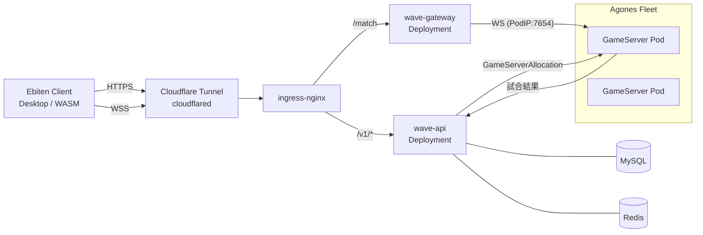
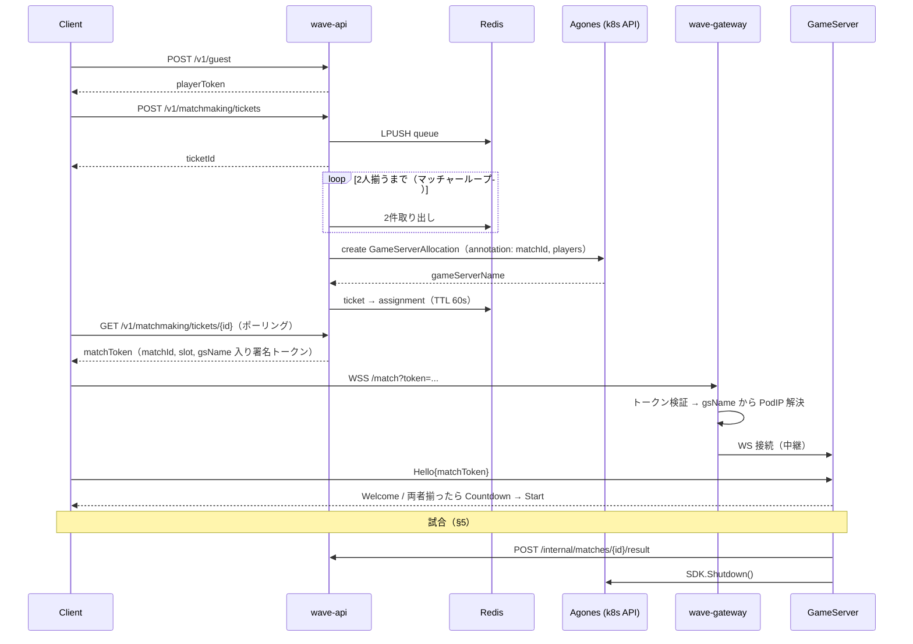

# Wave Duel — オンライン対戦化 設計書

**ステータス:** Draft
**作成日:** 2026-09-26
**関連:** [requirements.md](requirements.md)（ゲーム仕様）、インフラ: `o-ga09/infra`（おうちk3s / ArgoCD）

---

## 目次

1. [目的とスコープ](#1-目的とスコープ)
2. [決定事項サマリ](#2-決定事項サマリ)
3. [リアルタイム化後のゲームルール（v0）](#3-リアルタイム化後のゲームルールv0)
4. [全体アーキテクチャ](#4-全体アーキテクチャ)
5. [ネットコード](#5-ネットコード)
6. [ゲームサーバ（Agones）](#6-ゲームサーバagones)
7. [WebSocket ゲートウェイ](#7-websocket-ゲートウェイ)
8. [ゲーム API サーバ](#8-ゲーム-api-サーバ)
9. [インフラ（おうちk3s）](#9-インフラおうちk3s)
10. [リポジトリ構成](#10-リポジトリ構成)
11. [開発フェーズ](#11-開発フェーズ)
12. [リスク・未決事項](#12-リスク未決事項)

---

## 1. 目的とスコープ

現状の Wave Duel は「1台のキーボードで P1 → P2 の順に波を撃つターン制」のローカル対戦である。これを以下の形に作り替える。

- **リアルタイムアクション**化（両者が同時に動き・撃ち合う）
- **オンライン 1vs1 対戦**（サーバ権威型）
- ゲームサーバは **Agones** で試合単位にスケール、周辺機能は **ゲーム API サーバ** が担当
- 実行基盤は **おうちk3s**（ArgoCD GitOps、Cloudflare Tunnel 経由で公開）

### スコープ外（当面）

- ランクマッチ・レーティング、フレンド、観戦、リプレイ
- Open Match 等の本格マッチメイカー
- 本格的な認証（ソーシャルログイン等）
- モバイルネイティブビルド（WASM ブラウザ版とデスクトップ版を優先）

---

## 2. 決定事項サマリ

| # | 論点 | 決定 | 主な理由 |
|---|---|---|---|
| D1 | ゲーム性 | リアルタイムアクション | ユーザー要望 |
| D2 | 権威モデル | サーバ権威型（クライアント予測＋補間） | チート耐性・判定の一意性。ロックステップは遅延に弱く WASM/デスクトップ混在で浮動小数の完全一致が保証しにくい |
| D3 | トランスポート | **WebSocket（TCP）**、バイナリ（Protocol Buffers） | Cloudflare Tunnel を通せる唯一の実用手段。ブラウザ（WASM）でもそのまま動く |
| D4 | 外部公開 | **案B: WebSocket ゲートウェイ経由**（Tunnel → ingress-nginx → gateway → GameServer Pod） | 自宅 IP・ポートを公開しない。既存アプリと同じ公開経路 |
| D5 | マッチング | API サーバ内の簡易キュー（Redis） | まず動くものを優先。Open Match は将来 |
| D6 | 認証 | ゲストログイン（サーバ署名トークン） | 簡易で十分 |
| D7 | DB | 既存クラスタの MySQL / Redis を利用 | 新規ミドルウェアを増やさない |
| D8 | ドメイン | `*.o-ga09.com`（他アプリと同じ） | 既存 Tunnel 設定を流用 |

### D3 の補足：TCP でアクションをやることのトレードオフ

TCP はパケットロス時に後続データが詰まる（Head-of-Line blocking）ため、UDP 系より遅延のブレが大きい。ただし本作は

- 1vs1・送受信データが小さい（入力数バイト、スナップショット数百バイト）
- 波は「発射パラメータ＋発射 tick」から解析的に位置が決まるため、**波そのものを毎 tick 同期する必要がない**
- 弾速が比較的遅い（画面横断に 1.5〜2 秒）ので数十 ms の遅延は体感しにくい

ことから、WebSocket で十分成立すると判断する。将来 UDP/WebTransport が必要になった場合は Tunnel を迂回する経路（VPS リレー等）が別途必要になるため、その時点で ADR を起こす。

---

## 3. リアルタイム化後のゲームルール（v0）

> Phase 1 でローカル動作させながら数値を調整する前提の**たたき台**。数値はすべて暫定。

### フィールド

- 論理解像度 **1280×720**（requirements.md に合わせる）
- P1 は左端（x=80）、P2 は右端（x=1200）に位置し、**上下（y 方向）に移動**できる
- 中央の水平線（y=360）が波の基準線

### 波（ウェーブパケット）

- 発射すると自陣側から相手側へ一定速度 `v`（暫定 700 px/s）で進む**有限長のパケット**（暫定 1.5 波長ぶん）が生まれる
- パケットは発射時の `{Type, Amplitude, Frequency, Phase}` と `spawnTick`、`owner` だけで状態が決まる（=決定的）
- フィールド上の変位は全パケットの**重ね合わせ**：`y(x,t) = Σ packet_i(x,t)`
  - 両者のパケットが重なる区間では干渉が起き、逆位相なら打ち消し合い、同位相なら強め合う

### 被弾判定

- 相手のパケットが自分の x 座標を通過している間、毎 tick 判定する
- `|(基準線 − y(x_self, t)) − playerY| < hitRadius` なら被弾
  - つまり**波の山・谷が自分に当たるか**がアクション要素。上下移動で避ける、または自分の波で打ち消して「低く」する
- ダメージ = `|y(x_self,t)| × DamageCoeff × WaveTypeMultiplier`、同一パケットからの被弾は 1 回のみ（多段ヒットなし）
- 被弾後 0.5 秒の無敵時間

### リソース

- **エネルギー**（最大 100、毎秒 +20 回復）。発射コスト ∝ `Amplitude × Frequency`
  - 大振幅・高周波は強いが連射できない
- パラメータ（振幅・周波数・位相・波種）は移動しながら常時調整可能

### 勝敗

- HP 100。HP 0 で敗北。**制限時間 90 秒**、時間切れは残 HP 割合で判定、同値は引き分け

### 後回しにする要素

共鳴ゲージ、環境波、必殺波は requirements.md の Phase 5 相当として、オンライン基盤が動いた後に追加する。

### 操作（PC）

| 操作 | キー |
|---|---|
| 上下移動 | `W` / `S` |
| 振幅 | `↑` / `↓` |
| 周波数 | `←` / `→` |
| 位相 | `Q` / `E` |
| 波種 | `1`〜`6` |
| 発射 | `Space` |

オンラインでは 1 端末 1 プレイヤーなので、P1/P2 のキー分けは不要になる。ローカル 2P モードは残す場合のみ別バインドを用意する。

---

## 4. 全体アーキテクチャ



### 公開エンドポイント

単一ホストでパス分けする（Tunnel / Ingress 設定を最小にするため）。

| ホスト | パス | 転送先 |
|---|---|---|
| `wave-duel.o-ga09.com` | `/v1/*` | wave-api |
| `wave-duel.o-ga09.com` | `/match` | wave-gateway（WebSocket） |
| `wave-duel.o-ga09.com` | `/` | WASM クライアント配信（Phase 6、wave-api で静的配信でも可） |
| `wave-duel.home.local` | 同上 | LAN 内確認用 |

### 試合開始までのシーケンス



---

## 5. ネットコード

### 基本方針

- **固定 tick シミュレーション 60Hz**（サーバ・クライアント共通の `internal/sim`）
- サーバが唯一の正。クライアントは**自分の入力を先行適用（予測）**し、サーバのスナップショットで補正する
- 相手プレイヤーは**補間表示**（約 100ms 遅らせて過去 2 スナップショット間を線形補間）
- 波パケットは発射イベントで一度だけ同期し、以後は各クライアントが `spawnTick` から解析的に計算する

### メッセージ

| 方向 | メッセージ | 頻度 | 内容 |
|---|---|---|---|
| C→S | `Hello` | 接続時 | matchToken、クライアントバージョン |
| C→S | `Input` | 30Hz（2 tick 分まとめて送信） | `seq`, `tick`, 移動軸, パラメータ変更, 発射フラグ |
| C→S | `Ping` | 1Hz | クライアント時刻（RTT 計測・時刻同期用） |
| S→C | `Welcome` | 接続時 | slot（0/1）、サーバ tick、ルール定数 |
| S→C | `Snapshot` | 20Hz | サーバ tick、各プレイヤー `{y, hp, energy, params}`、`lastProcessedSeq`（自分の分） |
| S→C | `Event` | 即時 | `WaveSpawned{id, owner, params, spawnTick}`、`Hit{target, damage, packetId}`、`MatchEnd{winner, reason}` |
| S→C | `Pong` | 1Hz | クライアント時刻のエコー＋サーバ tick |

- エンコードは Protocol Buffers（`proto/wave/v1/*.proto`）。WebSocket のバイナリフレームで送る
- Cloudflare の WebSocket アイドルタイムアウト（100 秒）対策として `Ping` を常時送る

### クライアント予測と補正（リコンシリエーション）

1. クライアントは入力に連番 `seq` を振り、ローカルの `sim` に即適用し、未確認入力としてバッファする
2. `Snapshot` を受信したら、自分の状態をサーバ値で上書きし、`lastProcessedSeq` より後の未確認入力を再適用する
3. 誤差が小さければ数フレームかけて滑らかに寄せ、大きければ即座に合わせる（スナップ）

### 発射の扱い

- クライアントは発射を**予測表示**する（仮 ID のパケットを即描画）
- サーバが入力を処理した tick で正式な `WaveSpawned` を送る → 仮パケットを正式 ID・正式 `spawnTick` に置き換える
- サーバは入力を**受信した tick で適用**する（巻き戻しによるラグ補償はしない）。弾速が遅いため v0 では不要と判断する

### 時刻同期

`Ping`/`Pong` の RTT から `serverTick ≈ localTick + offset` を推定し、補間の基準時刻とパケット位置の計算に使う。

### 決定性について

サーバ権威型なので、クライアント・サーバ間でのビット単位の一致は**不要**（ズレはスナップショットで補正される）。ただし、判定を再現・テストできるように `sim` は以下を守る。

- 時間は必ず整数 `tick` で進める（`time.Now()` や描画フレームに依存しない）
- 乱数を使う場合はシード付きで、`sim` の状態に含める
- 現行コードの「`StateResolve` 中に `g.tick` 依存で最大振幅をサンプリングする」処理は廃止する

---

## 6. ゲームサーバ（Agones）

### プロセス構成（`cmd/gameserver`）

- WebSocket サーバ（`:7654`）＋ 60Hz のシミュレーションループ
- **Agones SDK**
  - 起動 → `Ready()`
  - 定期的に `Health()`
  - `WatchGameServer` で Allocated を検知したら、annotation から `matchId` と参加 `playerId` を読む
  - 試合終了 → 結果を API に送信 → `Shutdown()`
- 接続時は `Hello` の matchToken を検証し、`matchId` と `playerId` が annotation と一致しなければ切断する
- タイムアウト
  - Allocated 後 30 秒以内に 2 人揃わなければ試合を中止（`MatchEnd{reason: abandoned}`）→ Shutdown
  - 試合中の切断は 10 秒まで再接続を待ち、戻らなければ不戦敗
- ローカル開発用に `-local` フラグで SDK 呼び出しをスキップする（Agones なしで起動できる）

### Fleet 設定の方針

```yaml
# manifests/wave-duel/fleet.yaml（抜粋・イメージ）
apiVersion: agones.dev/v1
kind: Fleet
metadata:
  name: wave-gameserver
  namespace: wave-duel
spec:
  replicas: 2
  template:
    spec:
      ports:
      - name: ws
        portPolicy: None        # ゲートウェイが PodIP:containerPort に直結するため hostPort は不要
        containerPort: 7654
        protocol: TCP
      health:
        initialDelaySeconds: 5
        periodSeconds: 5
      template:
        spec:
          imagePullSecrets:
          - name: gar-secret
          containers:
          - name: wave-gameserver   # CI がこの name でイメージタグを書き換える
            image: asia-northeast1-docker.pkg.dev/.../wave-gameserver:<sha>
            resources:
              requests: { cpu: 50m, memory: 32Mi }
              limits:   { cpu: 500m, memory: 128Mi }
---
apiVersion: autoscaling.agones.dev/v1
kind: FleetAutoscaler
metadata:
  name: wave-gameserver
  namespace: wave-duel
spec:
  fleetName: wave-gameserver
  policy:
    type: Buffer
    buffer:
      bufferSize: 2
      minReplicas: 2
      maxReplicas: 10
```

- `portPolicy: None` を使う（hostPort を消費しないため、2 ノード構成でもポート枯渇の心配がない）
- イメージを更新すると Fleet がローリング更新される。Allocated（試合中）の GameServer は削除されないため、試合は中断されない

### 割り当て（Allocation）

wave-api が in-cluster の k8s API で `GameServerAllocation` を作成する（Allocator Service の mTLS 設定を省くため）。

```yaml
apiVersion: allocation.agones.dev/v1
kind: GameServerAllocation
spec:
  selectors:
  - matchLabels:
      agones.dev/fleet: wave-gameserver
  metadata:
    annotations:
      wave-duel/match-id: "<matchId>"
      wave-duel/players: "<playerId0>,<playerId1>"
```

wave-api の ServiceAccount には `allocation.agones.dev` の `gameserverallocations: create` 権限を付与する。

---

## 7. WebSocket ゲートウェイ

### 役割

`wss://wave-duel.o-ga09.com/match?token=...` を受け、トークン内の `gsName` から GameServer の **PodIP** を解決して、双方向にバイトを中継する。

- ゲートウェイは中身を解釈しない（プロトコル変更の影響を受けない）
- PodIP の解決は `GameServer` リソースの `status.addresses` のうち `type: PodIP` を使う
  - Agones は `status.addresses` に Pod IP を含める。ただし代表の `status.address` には含めない
  - 必要な RBAC は `gameservers: get`（数秒キャッシュする）
- トークン検証：署名、有効期限（60 秒）、`gsName` の存在確認。クエリにトークンを載せるため、**短命かつ試合限定**のトークンにする

### API サーバと分ける理由

API のデプロイ（再起動）で試合中の接続が切れないように、ゲートウェイは別 Deployment にして変更頻度を低く保つ。ステートレスなのでレプリカを増やせる。

---

## 8. ゲーム API サーバ

### エンドポイント

| メソッド | パス | 説明 |
|---|---|---|
| `POST` | `/v1/guest` | ゲストユーザー作成。`playerToken`（HS256、30 日）を返す |
| `GET` | `/v1/me` | 自分の情報・戦績サマリ |
| `POST` | `/v1/matchmaking/tickets` | マッチングキューに参加。`ticketId` を返す |
| `GET` | `/v1/matchmaking/tickets/{id}` | 状態（`waiting` / `matched` + `matchToken` / `expired`） |
| `DELETE` | `/v1/matchmaking/tickets/{id}` | キャンセル |
| `POST` | `/internal/matches/{id}/result` | GameServer からの結果報告（内部トークン認証、Ingress には出さない） |
| `GET` | `/healthz` | ヘルスチェック |

v0 ではポーリング（1 秒間隔）で実装する。長時間ポーリングや SSE は必要になってから検討する。

### マッチング（簡易キュー）

- Redis の List `mm:queue` にチケットを積む。チケット本体は `mm:ticket:{id}`（TTL 60 秒）
- API 内のマッチャー goroutine が 500ms ごとに 2 件取り出して組む
  - wave-api は 1 レプリカ前提。複数にするなら Redis ロックかリーダー選出を入れる
- 組めたら Allocation を作成する
  - 失敗（Fleet が空など）したら両チケットをキューの先頭に戻す

### データモデル（MySQL）

```sql
CREATE TABLE players (
  id          CHAR(26)     PRIMARY KEY,   -- ULID
  display_name VARCHAR(32) NOT NULL,
  created_at  DATETIME(3)  NOT NULL
);

CREATE TABLE matches (
  id           CHAR(26)    PRIMARY KEY,
  game_server  VARCHAR(128) NOT NULL,
  player0_id   CHAR(26)    NOT NULL,
  player1_id   CHAR(26)    NOT NULL,
  winner_slot  TINYINT     NULL,           -- 0 / 1 / NULL(引き分け・中止)
  end_reason   VARCHAR(16) NOT NULL,       -- ko / timeout / disconnect / abandoned
  started_at   DATETIME(3) NOT NULL,
  ended_at     DATETIME(3) NULL
);
```

マイグレーションは他アプリと同じ `migration-job.yaml` 方式（コンテナ名は `migration`）。

### トークン

| 種類 | 用途 | 中身 | 有効期限 |
|---|---|---|---|
| playerToken | API 認証 | `sub=playerId` | 30 日 |
| matchToken | ゲートウェイ / GameServer への入室 | `matchId, playerId, slot, gsName` | 60 秒 |
| internalToken | GameServer → API | 固定の共有シークレット | — |

署名鍵は SealedSecret（`wave-duel-secret`）で配布し、API・ゲートウェイ・GameServer が共有する。

---

## 9. インフラ（おうちk3s）

`o-ga09/infra` への追加内容。infra リポジトリは main への push が即本番反映となるため、**push 前に確認を取る**。

### 追加するもの

```
apps/
├── agones.yaml              # Agones 本体（Helm chart: https://agones.dev/chart/stable、バージョン固定）
└── wave-duel.yaml
manifests/wave-duel/
├── namespace.yaml
├── fleet.yaml               # Fleet + FleetAutoscaler
├── api-deployment.yaml      # container name: wave-api
├── api-service.yaml
├── gateway-deployment.yaml  # container name: wave-gateway
├── gateway-service.yaml
├── rbac.yaml                # api: allocation create / gateway: gameservers get
├── ingress.yaml             # wave-duel.o-ga09.com, wave-duel.home.local
├── migration-job.yaml       # container name: migration
├── servicemonitor.yaml
└── sealed-secret.yaml       # wave-duel-secret, gar-secret
```

### Agones 導入時の注意

- CRD が大きいため、ArgoCD Application に `syncOptions: [ServerSideApply=true]` を付ける
- Helm values で `gameservers.namespaces: [wave-duel]` を指定し、GameServer を作れる namespace を限定する
- k3s のバージョンと Agones の対応 Kubernetes バージョンを事前に照合する
- ノードのアーキテクチャ（amd64 / arm64）を確認する。イメージは両対応でビルドしておくと安全
- 2 ノードの空きリソースを確認する。Agones 本体（controller / extensions / allocator / ping）は合計で数百 MB 規模
  - allocator と ping は今回使わないので無効化してよい

### 公開

- Cloudflare Tunnel の Public Hostname に `wave-duel.o-ga09.com` → ingress-nginx を追加する（他アプリと同じ）
- ingress-nginx の WebSocket 用に以下の annotation を付ける
  - `nginx.ingress.kubernetes.io/proxy-read-timeout: "3600"`
  - `proxy-send-timeout: "3600"`

### CI/CD

他アプリと同じ流れにする。

1. ebiten リポジトリの GitHub Actions でイメージ 3 種（`wave-api` / `wave-gateway` / `wave-gameserver`）を GAR に push する
2. infra リポジトリの該当マニフェストの `image` を、コンテナ名をキーに `yq` で書き換えて commit する
   - Fleet は `.spec.template.spec.template.spec.containers[]` が対象になる点に注意

### 可観測性

- ログ：標準出力に JSON で出す（promtail → Loki）
- トレース：`OTEL_EXPORTER_OTLP_ENDPOINT=tempo.monitoring.svc.cluster.local:4317`
- メトリクス：`/metrics`（ServiceMonitor）
  - 例：試合数、マッチング待ち時間、GameServer の tick 処理時間、接続数

---

## 10. リポジトリ構成

```
cmd/
├── client/main.go        # 現 cmd/main.go を移設（Ebiten クライアント。ローカル / オンライン両対応）
├── gameserver/main.go
├── gateway/main.go
└── api/main.go
internal/
├── sim/                  # ebiten 非依存の純粋ロジック（波・パケット・判定・状態遷移）★最優先でテスト
├── game/                 # 現 internal/*.go（描画・入力・画面遷移）。sim を使う
├── netcode/              # 予測・補正・補間・時刻同期（クライアント側）
├── gameserver/
├── gateway/
└── api/
proto/wave/v1/            # メッセージ定義
deploy/local/             # kind/k3d + Agones のローカル検証用（任意）
Dockerfile.*              # 各バイナリ用（distroless / multi-arch）
```

CLAUDE.md のファイル責務表と「`internal/` 直下は `package game`」の規約は、Phase 1 で上記構成に合わせて更新する。

---

## 11. 開発フェーズ

| Phase | 内容 | 完了条件 |
|---|---|---|
| **P1** | `internal/sim` の切り出しとリアルタイムルール v0 をローカルで実装 | 1 台で 2P のリアルタイム対戦が遊べる。sim のユニットテストが通る |
| **P2** | proto 定義、`cmd/gameserver`（`-local`）、クライアントのオンラインモード（予測・補間） | localhost / LAN で 2 クライアントが直結対戦できる。遅延を注入しても破綻しない |
| **P3** | infra に Agones 導入と Fleet 作成、SDK 組み込み、`cmd/gateway` | 手動 Allocation → ゲートウェイ経由で対戦 → 終了後に Shutdown される |
| **P4** | `cmd/api`：ゲスト認証、簡易マッチング、Allocation、結果保存 | 2 クライアントがキューに入るだけで試合が始まり、結果が MySQL に残る |
| **P5** | CI/CD（GAR・infra 自動更新）、Tunnel 公開、監視ダッシュボード | `wave-duel.o-ga09.com` 経由で外部から対戦できる |
| **P6** | WASM クライアント配信、共鳴・環境波などゲーム要素の追加 | ブラウザで遊べる |

---

## 12. リスク・未決事項

| 項目 | 内容 | 対応 |
|---|---|---|
| TCP の遅延のブレ | ロスがあると一時的に詰まる | P2 で遅延・ロスを注入して検証。問題があれば入力の冗長送信・補間バッファ拡大。根本対策（UDP）は別 ADR |
| Cloudflare 経由の RTT | 自宅 → Cloudflare → 自宅の往復で数十 ms が加算される | 弾速・無敵時間などのゲームデザイン側で吸収する |
| 自宅回線・停電 | 単一拠点 | 趣味運用として許容する |
| ルール v0 の面白さ | 未検証 | P1 で早期にプレイして調整する。§3 はたたき台 |
| Agones とクラスタの相性 | k3s バージョン、アーキテクチャ、リソースが未確認（作成時点でクラスタに到達不可） | P3 着手前に `kubectl get nodes -o wide` 等で確認 |
| wave-api の単一レプリカ | マッチャーが単一インスタンス前提 | 当面は許容。スケール時に Redis ロックを導入 |
